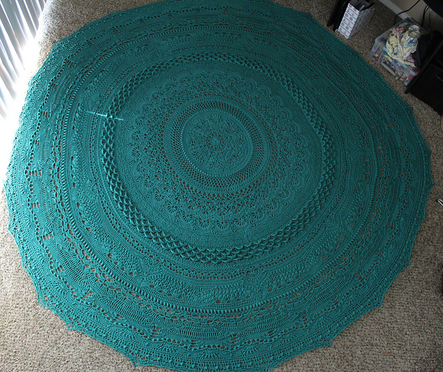

<h1> Knitworthy </h1>

- In the knitting/crochet/fiber arts community, someone who appreciates a handmade gift and takes care of it is considered "knitworthy." Ravelry, a fiber arts website with over 9 million users, created a hub for sharing information about materials and techniques and a way to exchange and sell patterns in pdf form. Users can keep track of their yarn and their projects, entering stats about when they started and finished, the yarn they used, etc. Knitworthy will use the Ravelry API to generate facts that put the amount of love that goes into a handmade fiber arts gift into perspective for a layman. For example, selecting the project below, a crochet blanket made following the pattern Rings of Change by Frank O'Randle, would result in a fact like "The yarn in your Rings of Change project could cover the width of Manhattan Island 1.48 times."

<h2> Summary </h2>

  - [Getting Started](#getting-started)
  - [Runing the tests](#running-the-tests)
  - [Deployment](#deployment)
  - [Built With](#built-with)
  - [Contributing](#contributing)
  - [Versioning](#versioning)
  - [Authors](#authors)
  - [Screenshots](#screenshots)
  - [Acknowledgments](#acknowledgments)

## Getting Started

These instructions will get you a copy of the project up and running on
your local machine for development and testing purposes. See deployment
for notes on how to deploy the project on a live system.

### Prerequisites

What things you need to install the software and how to install them.
You will have a better understanding of what goes here next week.

    Give examples like what node modules are required
    nodemon 
    express version => 3.3
    uuid version =< v1.01
    etc

### Installing

A step by step series of examples that tell you how to get a development
env running

Say what the step will be - **First Install express-router** -

    Give the example: 
    npm install express-router

And repeat all steps

    until finished

End with an example of getting some data out of the system or using it
for a little demo

## Running the tests

Explain how to run the automated tests for this system

### Break down into end to end tests

Explain what these tests test and why

    Give an example

### And coding style tests

Explain what these tests test and why

    Give an example

## Deployment

Add additional notes about how to deploy this on a live system

## Built With

  - [Contributor Covenant](https://www.contributor-covenant.org/) - Used
    for the Code of Conduct
  - [Creative Commons](https://creativecommons.org/) - Used to choose
    the license

## Contributing

Please read [CONTRIBUTING.md](CONTRIBUTING.md) for details on our code
of conduct, and the process for submitting pull requests to us.

## Versioning

We use [SemVer](http://semver.org/) for versioning. For the versions
available, see the [tags on this
repository](https://github.com/PurpleBooth/a-good-readme-template/tags).

## Authors

  - **Billie Thompson** - *Provided README Template* -
    [PurpleBooth](https://github.com/PurpleBooth)
  - **Nathan Orris** - *The Certified* - **DiR at DigitalCrafts Houston** -
    [NathanNoSudo](https://github.com/NathanNoSudo)

## Screenshots

Obviously screenshots of you projects go here. You can even add GIFs if its a bigger project and has more pages or functionality. I really reccomend GIF's for your upcoming projects in the course!

## Acknowledgments

  - Hat tip to anyone whose code was used
  - Inspiration
  - etc

