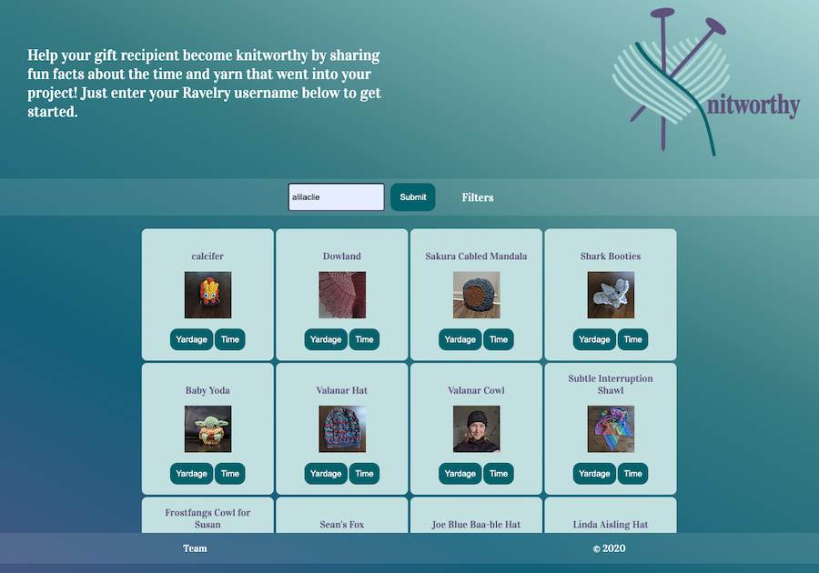
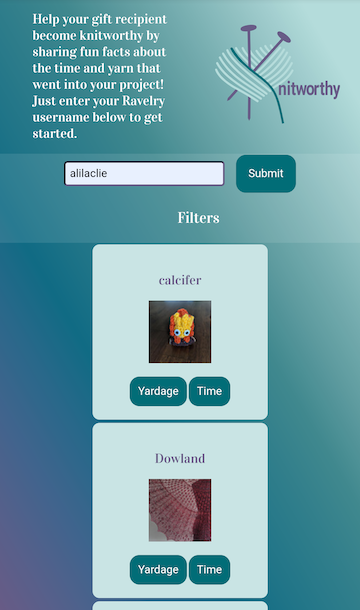

<h1> Knitworthy </h1>

  

<h2> Summary </h2>

  - [About the Project](#about-the-project)
  - [Usage](#usage)
  - [Videos and Screenshots](#videos-and-screenshots)
  - [Getting Started](#getting-started)
  - [Built With](#built-with)
  - [Contributing](#contributing)
  - [Authors](#authors)
  - [Acknowledgments](#acknowledgments)

## About the Project

- In the knitting/crochet/fiber arts community, someone who appreciates a handmade gift and takes care of it is considered "knitworthy." Ravelry, a fiber arts website with over 9 million users, created a hub for sharing information about materials and techniques and a way to exchange and sell patterns in pdf form. Users can keep track of their yarn and their projects, entering stats about when they started and finished, the yarn they used, etc. Knitworthy uses the Ravelry API to generate fun facts about the time and yarn that went into a Ravelry user's project.

## Usage

- Knitworthy compares project data to real life time and length measurements to put the time and length of yarn that goes into a project into perspective for someone who does not knit or crochet.

- Visit [Knitworthy](http://knitworthy.surge.sh/) and enter some Ravelry usernames like alilaclie, knitqueen, and fisheep31.

## Videos and Screenshots






## Getting Started

### Installation

1. Clone to local machine
```sh
git clone https://github.com/github_username/repo_name.git
```
2. You need an Basic Auth: Read Only API Key from the [Ravelry API](https://www.ravelry.com/api). Then add your API in `keys.js`
```JS
username = "ENTER YOUR API USERNAME";
password = "ENTER YOUR API PASSWORD";
```

## Built With

  - [Javascript](https://www.javascript.com/)
  - [HTML](https://html.spec.whatwg.org/)
  - [CSS](https://www.w3.org/Style/CSS/Overview.en.html)
  - [Bootstrap](https://getbootstrap.com/)
  - [Cloudflare](https://www.cloudflare.com/)

## Contributing

Please reach out to Abbey Perini at abbeyperini@gmail.com if you are interested in contributing.

## Authors

  - **Abbey Perini** - [abbeyperini](https://github.com/abbeyperini)
  - **Borinquen "Boris" Rodriguez** - [brodri4](https://github.com/brodri4)
  - **Jonathan Nuno** - [Jonathan-Nuno](https://github.com/Jonathan-Nuno)
  - **Hung Tran** - [hptran7](https://github.com/hptran7)

## Acknowledgments

  - **Nathan Orris** - *The Certified* [](https://github.com/sindresorhus/awesome)- **DiR at DigitalCrafts Houston** -
    [NathanNoSudo](https://github.com/NathanNoSudo)

